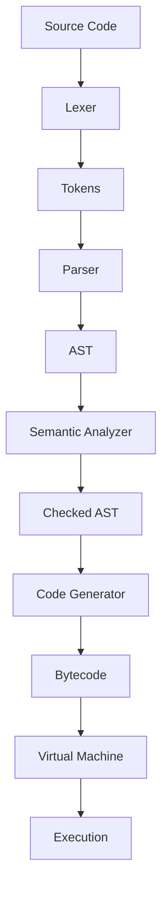

# Architectural Notes

This document provides a deep dive into the architecture and internal workings of `pulse`. It is intended for maintainers, contributors, and advanced users who wish to understand the compiler's design philosophy, core mechanics, and implementation details.

## 1. Core Design Philosophy

The architecture of `pulse` is the result of deliberate design choices balancing educational clarity, performance, and maintainability.

### 1.1 Guiding Principles

Three high-level principles guide the library's development:

1.  **Educational Clarity:** The codebase should be readable and understandable, serving as a reference implementation for language compilation.
2.  **Modern Language Features:** Include features from modern languages (classes, fibers, exceptions) while keeping the implementation clean and modular.
3.  **Performance:** The emit library generates optimized native code, and the VM uses efficient bytecode interpretation with garbage collection.

### 1.2 Key Architectural Decisions

#### The Unity Build
`pulse` is designed to be built as a single translation unit. The top-level `src/pulse.c` file simply `#include`s all other core `.c` files.

*   **Rationale**:
    1.  **Simplicity of Integration:** A user can add `src/pulse.c` and the `include` directory to their project, and it will build without complex makefiles.
    2.  **Potential for Optimization:** Compiling the entire library as a single unit gives the compiler maximum visibility, enabling more aggressive inlining.
    3.  **Encapsulation:** Because most functions are declared `static`, we avoid polluting the global namespace.

#### The Emit Library
The `emit` library is responsible for generating native machine code for x86-64 platforms.

*   **PE Backend (Windows)**: Generates Windows Portable Executable (PE) format.
*   **ELF Backend (Unix)**: Generates Executable and Linkable Format (ELF) for Linux/macOS.

---

## 2. Compilation Pipeline

The `pulse` compiler follows a classic language implementation pipeline:



### 2.1 Lexer (Tokenization)

The lexer reads the source code character by character and produces a stream of tokens.

**Key Components:**
- `lexer_t`: The lexer state machine
- `token_t`: Represents each token with type, lexeme, and value
- `token_type_t`: Enumeration of all token types

**Token Categories:**
- **Literals**: `INTEGER`, `FLOAT`, `STRING`, `IDENTIFIER`, `TRUE`, `FALSE`, `NULL`
- **Keywords**: Language keywords like `fn`, `class`, `if`, `while`, etc.
- **Operators**: Arithmetic, logical, and comparison operators
- **Delimiters**: Parentheses, braces, brackets
- **Special**: `EOF`, `ERROR`, `COMMENT`, `NEWLINE`

### 2.2 Parser

The parser uses a recursive descent parsing strategy to build an Abstract Syntax Tree (AST).

**Key Components:**
- `parser_t`: The parser state
- `ast_node_t`: The AST node structure with a union for different node types
- `ast_node_type_t`: Enumeration of all AST node types

**AST Node Categories:**
- **Declarations**: `NAMESPACE_DECL`, `CLASS_DECL`, `FUNCTION_DECL`, `VAR_DECL`, `CONST_DECL`
- **Statements**: `BLOCK`, `IF_STMT`, `WHILE_STMT`, `FOR_STMT`, `RETURN_STMT`, `TRY_STMT`
- **Expressions**: `BINARY_EXPR`, `UNARY_EXPR`, `CALL_EXPR`, `MEMBER_EXPR`, `LAMBDA_EXPR`

### 2.3 Semantic Analyzer

The semantic analyzer performs type checking, symbol resolution, and scope management.

**Key Components:**
- `sema_t`: The semantic analyzer state
- `scope_t`: Represents a lexical scope with symbols
- `symbol_t`: Represents a declared identifier
- `type_t`: Represents a data type

**Responsibilities:**
- Symbol table management (push/pop scopes)
- Type inference and checking
- Variable resolution
- Function overloading resolution

### 2.4 Code Generator

The code generator transforms the checked AST into bytecode instructions.

**Key Components:**
- `codegen_t`: The code generator state
- `function_t`: Represents a compiled function with bytecode
- `instruction_t`: Linked list of bytecode instructions
- `opcode_t`: Enumeration of all bytecode opcodes

**Bytecode Design:**
The VM uses a stack-based bytecode with the following categories:
- **Load/Store**: `OP_LOAD_LOCAL`, `OP_STORE_LOCAL`, `OP_LOAD_GLOBAL`
- **Arithmetic**: `OP_ADD`, `OP_SUB`, `OP_MUL`, `OP_DIV`, `OP_MOD`
- **Control Flow**: `OP_JUMP`, `OP_JUMP_IF_TRUE`, `OP_JUMP_IF_FALSE`
- **Function Call**: `OP_CALL`, `OP_RETURN`, `OP_CREATE_CLOSURE`
- **Object Model**: `OP_NEW_OBJECT`, `OP_NEW_ARRAY`, `OP_LOAD_FIELD`

### 2.5 Virtual Machine

The VM executes bytecode using a stack-based interpreter with garbage collection.

**Key Components:**
- `vm_t`: The virtual machine state
- `vm_frame_t`: Represents a call frame (function activation)
- `vm_object_t`: Heap-allocated objects (strings, arrays, objects, instances)

**Memory Layout:**
```
+------------------+
|     Stack        |  <- Grows downward
+------------------+
|                  |
|    (grows)       |
|                  |
+------------------+
|     Heap         |  <- Garbage collected
+------------------+
|                  |
|    (allocates)    |
|                  |
+------------------+
```

**Garbage Collection:**
The VM uses a simple mark-and-sweep garbage collector:
1. **Mark**: Starting from GC roots (globals, stack), mark all reachable objects
2. **Sweep**: Free all unmarked objects
3. **Compact**: Optional - defragment heap

---

## 3. Language Features

### 3.1 Variables and Constants

```c
var x = 10;        // Mutable variable
const y = 20;     // Immutable constant
```

**Implementation:**
- Variables are stored in the current scope's symbol table
- `var` creates a mutable binding; `const` creates an immutable one
- Stack offsets are assigned during code generation

### 3.2 Functions

```c
fn add(a, b) {
    return a + b;
}
```

**Implementation:**
- Functions are compiled to `function_t` objects
- The VM creates `vm_frame_t` for each function call
- Closures capture variables from enclosing scopes

### 3.3 Classes

```c
class Point {
    init(x, y) {
        this.x = x;
        this.y = y;
    }
    
    distance_to(other) {
        return sqrt((this.x - other.x) ** 2 + (this.y - other.y) ** 2);
    }
}
```

**Implementation:**
- Classes are represented by `vm_object_t` with type `TYPE_CLASS`
- Class instances are `vm_object_t` with type `TYPE_OBJECT`
- Method resolution uses the class's method table

### 3.4 Fibers (Coroutines)

```c
fn counter() {
    var i = 0;
    while (i < 10) {
        yield i;
        i = i + 1;
    }
}
```

**Implementation:**
- Fibers are `vm_object_t` with type `TYPE_FIBER`
- Each fiber has its own stack and instruction pointer
- `yield` saves the current frame and transfers control
- `Fiber.call()` resumes a suspended fiber

### 3.5 Exceptions

```c
try {
    risky_operation();
} catch err {
    print("Error: " + err);
} finally {
    cleanup();
}
```

**Implementation:**
- `throw` creates an exception object and unwinds the stack
- `try` blocks set up exception handlers in the VM
- `catch` clauses match exception types and handle errors
- `finally` blocks always execute for cleanup

---

## 4. The Emit Library

The `emit` library generates native machine code for x86-64 platforms.

### 4.1 Supported Backends

| Backend | Platform | File Format |
|---------|----------|-------------|
| PE      | Windows  | PE/COFF     |
| ELF     | Linux/macOS | ELF      |

### 4.2 Code Buffer

```c
typedef struct {
    uint8_t* data;
    size_t size;
    size_t capacity;
} code_buffer;
```

The code buffer grows dynamically and stores raw machine code bytes.

### 4.3 Instruction Emission

Each backend provides functions to emit architecture-specific instructions:

```c
// x64/emit_x64.h
void emit_x64_mov_r64_imm32(code_buffer* buf, uint8_t reg, uint32_t imm);
void emit_x64_push_r64(code_buffer* buf, uint8_t reg);
void emit_x64_pop_r64(code_buffer* buf, uint8_t reg);
void emit_x64_add_r64_r64(code_buffer* buf, uint8_t dest, uint8_t src);
// ... etc
```

### 4.4 PE Format (Windows)

The PE backend generates:
- DOS header
- PE signature
- COFF file header
- Optional header
- Section headers
- Section data (.text, .data, .rdata)

### 4.5 ELF Format (Unix)

The ELF backend generates:
- ELF header
- Program headers
- Section headers
- Section data (.text, .data, .shstrtab)

---

## 5. Maintainer's Debugging Guide

### Method 1: AST and Bytecode Dumping

Enable dumping during compilation:

```c
infix_compiler_t* compiler = infix_compiler_create();
infix_set_dump_ast(compiler, true);
infix_set_dump_bytecode(compiler, true);
infix_compile(compiler, source);
```

### Method 2: Verbose Mode

Enable verbose output:

```c
infix_set_verbose(compiler, true);
```

### Method 3: Direct VM Inspection

The VM stores state that can be inspected:

```c
vm_t* vm = compiler->vm;
printf("Stack depth: %ld\n", vm->stack_top - vm->stack);
printf("Heap objects: %d\n", vm->gc_count);
```

### Method 4: Test Suite

Run the existing test suite:

```bash
perl build.pl test
```

### Useful Tools

*   **Disassemblers**: `objdump`, ` IDA Pro`, `Ghidra` for inspecting generated code
*   **Hex Editors**: For inspecting PE/ELF binary format
*   **Valgrind**: For memory debugging on Unix
*   **AddressSanitizer**: For memory safety on all platforms
